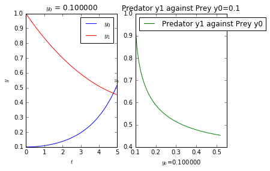
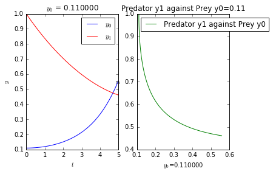

UECM3033 Assignment #3 Report
========================================================

- Prepared by: ** Chai Kun Ting**
- Tutorial Group: T3

--------------------------------------------------------

## Task 1 --  Gauss-Legendre formula

The reports, codes and supporting documents are to be uploaded to Github at: 

[https://github.com/chaikt12/UECM3033_assign3.git](https://github.com/chaikt12/UECM3033_assign3.git)

Explain how you implement your `task1.py` here.
In the task1, the define function gausslegendre will take in function, f(x) , lower and upper limit, a and b, and the n. The answer is set to be 0 initially. The weight multiple by the function is defined to be wf and it is initialize to be 0. then the sample point and the weight is calculated by a module which will be discuss below. Next, it will move into a for loop to sum up all n times of weight multiple by the function. Noted that due to the lower and upper limit is not -1 to 1, thus we will nid to change the interval into -1 to 1. It become $$\int_a^{b} f(x) dx = \frac{b-a}{2}\int_{-1}^{1} f(\frac{b-a}{2}x+\frac{a+b}{2}) dx.$$ Finally it will return answer by (b-a)/2 * the n time weight and function.
At the main function part, the integration is defined and calculated using sympy.integrate and the self defined gausslegendre function.

The weights and nodes used in the Gauss-Legendre quadrature.
the weight and node can be obtained by numpy..polynomial.legendre.leggauss. It will return sample point and weight in the form of array. 

---------------------------------------------------------

## Task 2 -- Predator-prey model

Explain how you implement your `task2.py` here, especially how to use `odeint`.
In task2, the I first defined the ode function in my_ ode that take in y, t, a and b, where y is a array of y0 and y1, t is from 0 to 5, a=1, b=0.2 where it will return diff. In the my_ode function, it contain two differential equation that assign to diff. Then i will initialize variables that given in the instruction. Also, create the y0_vector array that take in both intial y0 and y1 value. Next, use the odeint function that take in the my_ode function, intial vector y0_vector, t, which from 0 to 5 that have 6 point, and extra argument args=(a,b).

The next part is graph plotting. Use matplotlib.pyplot with the input of t as the x-axis, solution from odeint as y-axis. The first plot is consist of two line, blue and red of the odeint function created array. The blue line plot is the whole row of the array with the first column of the array. The red line plot is the whole row of the array with the second column of the array. The graph of y1 against y0 also plotted with green line. The second part is setting the y0_intial to be 0.11. Repeat the same procedure above and plot the graph. 

##y_0=0.1
##
##y_0=0.11
Is the system of ODE sensitive to initial condition? Explain.
The system of ODE is not sensitive to the initial condition. From the two differential equations, y_0' = a(y_0)(1-y_1 ) and y_1'=b(y_1)(1-y_0), we can see that the change in y_0 don"t have much effect on the ODE. This can also be seen in the graphs above where there is not much different between y_0=0.1 and 0.11.

-----------------------------------

last modified: 17/4/2016
